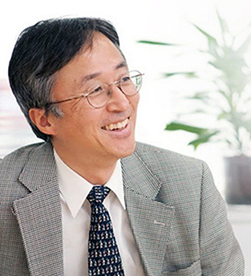
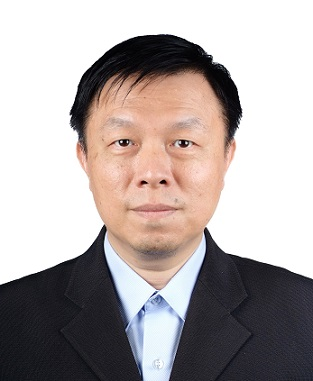

- MONDAY, 7 DECEMBER 2020 (FULL DAY)
- [WS-01: IEEE GLOBECOM 2020 Workshop on Optical Wireless Communications (OWC)](https://globecom2020.ieee-globecom.org/workshop/ws-01-workshop-optical-wireless-communications-owc)

## Invited Talk 1 (Live)

- 4:00-4:20 
  

### Dr. Jean-Paul Linnartz, Signify, Netherlands

#### Innovations in LED Wireless Communication Systems - Reviewing technical innovations that may make a difference.

- [Abstract and short bio](/blog/2020-1110-Invited-Talk-1-Prof-Dr-Ir-Jean-Paul-Linnartz/)

## Invited Talk 2 (Live)

- 4:20-4:40 
  

### Prof. Shinichiro Haruyama, Keio University, Japan

#### Two New Free-Space Optical Communication Technologies for Trains and Rail-Guided Industrial Vehicles

- [Abstract and short bio](/blog/2020-1110-Invited-Talk-2-Prof-Shinichiro-Haruyama-Keio-University-Japan/)

## Invited Talk 3 (Live)

- 4:40-5:00 
  

### Prof. Chien-Chung Lin, ITRI, Taiwan

#### Visible Light Communication System for Indoor Positioning and Secure Data Transmission Application

- [Abstract and short bio](/blog/2020-1110-Invited-Talk-3-Prof-Chien-Chung-Lin-ITRI-Taiwan/)

## Panel Discussion (Live)

- 5:00-5:30  

---

---

## Session I 9:00-10:30

### OWC and LiFi Systems (Chair: Takaya Yamazato)

|             |                                                                                                                                                                       |
| ----------- | --------------------------------------------------------------------------------------------------------------------------------------------------------------------- |
| 9:00-9:15   | A Novel Machine Learning-Based Handover Scheme for Hybrid LiFi and WiFi Networks _Xiping Wu, Dominic O'Brien_                                                      |
| 9:15-9:30   | Illuminance Constrained Emission Pattern Optimization in Indoor VLC Networks _Iman Abdalla, Michael Rahaim, Thomas DC Little_                                      |
| 9:30-9:45   | Spatial Channel Hardening For LiFi Networks _Jona Beysens, Qing Wang, Sofie Pollin_                                                                                |
| 9:45-10:00  | Leverage LiFi in Smart Manufacturing _Marcel Müller, Daniel Behnke, Patrick-Benjamin Bök, Christoph Kottke,  Kai Lennert Bober, Volker Jungnickel_              |
| 10:00-10:15 | Integration of Optical Wireless Communication with 5G Systems _Taner Metin, Marius Corici, Marc Emmelmann, Volker Jungnickel,  Christoph Kottke, Marcel Müller_ |

---

### Break 10:30-11:00

---

## Session II 11:00-12:30

### OWC Devices and Modulations (Chair: Koji Kamakura)

|             |                                                                                                                                                                           |
| ----------- | ------------------------------------------------------------------------------------------------------------------------------------------------------------------------- |
| 11:00-11:15 | Silicon photomultiplier receivers and future VLC systems _Wajahat Ali, Grahame Faulkner, Zubair Ahmed, William Matthews, Dominic O'Brien, Stephen Collins_          |
| 11:15-11:30 | Optical OFDM and SiPM Receivers _Cuiwei He, Zubair Ahmed, Stephen Collins_                                                                                             |
| 11:30-11:45 | Adaptive MIMO-VLC System for High Data Rate Communications _Fangxiao Dong, Ravinder Singh, Dominic O'Brien_                                                            |
| 11:45-12:00 | A Mixed Orthogonal Frequency Division Multiplexing (X-OFDM) Waveform for Optical Wireless Communication _Xu Li, Jingjing Huang, Yibo Lyu, Jiajin Luo, Zhang Junping_   |
| 12:00-12:15 | Chlorophyll concentration-based CSK constellation point optimization for Underwater SLIPT using Time Splitting receiver _Takuma Kogo, Yusuke Kozawa, Hiromasa Habuchi_ |

---

### Lunch 12:30-2:00pm

---

## Session III 2:00-3:30

### OCC, VLP and Other Applications (Chair: Chi-Wai Chow)

|           |                                                                                                                                                                                                                                                                  |
| --------- | ---------------------------------------------------------------------------------------------------------------------------------------------------------------------------------------------------------------------------------------------------------------- |
| 2:00-2:15 | Distributed MIMO Experiment Using LiFi Over Plastic Optical Fiber _Sepideh Mohammadi Kouhini, Sreelal Maravanchery Mana, Ronald Freund, Volker Jungnickel, Carina Barbio, Eduward Tangdiongga, Thiago Elias B Cunha, Xiong Deng, Jean-Paul M. G. Linnartz_ |
| 2:15-2:30 | Performance Evaluation of Range Estimation for Image Sensor Communication Using Phase-only Correlation _Ruiyi Huang, Masayuki Kinoshita, Takaya Yamazato, Hiraku Okada, Koji Kamakura, Shintaro Arai, Tomohiro Yendo, Toshiaki Fujii_                      |
| 2:30-2:45 | Implementation Experiment of a Rotary LED Transmitter for Improving the Transmission Rate for Image Sensor Communication _Shintaro Arai, Zhengqiang Tang, Akinori Nakayama, Haruhiko Takada, Tomohiro Yendo_                                                  |
| 2:45-3:00 | 3-D Indoor Visible Light Positioning (VLP) System based on Linear Regression or Kernel Ridge Regression Algorithms _Dong-Chang Lin, Yu-Chun Wu, Chong-You Hong, Shao-Hua Song, Yun-Shen Lin, Yang Liu, Chien-Hung Yeh, Chi-Wai Chow_                          |
| 3:00-3:15 | Line-of-sight distance extension of rolling-shutter OCC using dual-camera spatial luminance distribution _Yamato Noma, Wataru Chujo_                                                                                                                          |
| 3:15-3:30 | Near-field MIMO-VLC System with Display-Camera Smartphones _Chang-Ming Lee, Ming-Jun Zhong_                                                                                                                                                                   |

---

### Break 3:30-4:00pm

---

## Session IV 4:00-5:30 (Live)

### Invited Talks and Panel Discussion (Chair: Volker Jungnickel)

|           |                                                                                                                                                                                                                                                               |
| --------- | ------------------------------------------------------------------------------------------------------------------------------------------------------------------------------------------------------------------------------------------------------------- |
| 4:00-4:20 | [Invited Talk 1 : Innovations in LED Wireless Communication Systems - Reviewing technical innovations that may make a difference](/blog/2020-1110-Invited-Talk-1-Prof-Dr-Ir-Jean-Paul-Linnartz/) _Dr. Jean-Paul Linnartz, Signify, Netherlands_            |
| 4:20-4:40 | [Invited Talk 2: Two New Free-Space Optical Communication Technologies for Trains and Rail-Guided Industrial Vehicles](/blog/2020-1110-Invited-Talk-2-Prof-Shinichiro-Haruyama-Keio-University-Japan/) _Prof. Shinichiro Haruyama, Keio University, Japan_ |
| 4:40-5:00 | [Invited Talk 3: Visible Light Communication System for Indoor Positioning and Secure Data Transmission Application](/blog/2020-1110-Invited-Talk-3-Prof-Chien-Chung-Lin-ITRI-Taiwan/) _Prof. Chien-Chung Lin, ITRI, Taiwan_                               |
| 5:00-5:30 | Panel Discussion                                                                                                                                                                                                                                              |

---
